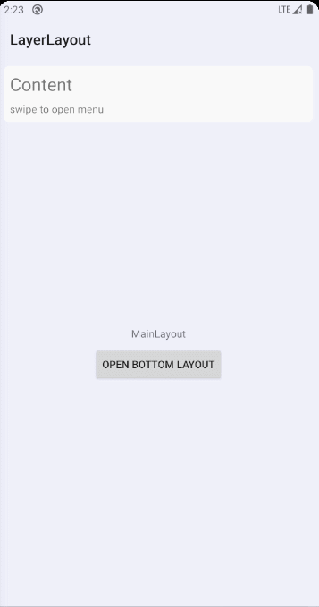

# LayerLayout


Android layer layout

- [LayerLayout](#layerlayout)
  - [简介](#简介)
  - [Gradle](#gradle)
  - [使用](#使用)
    - [示例](#示例)
    - [使用DataBinding](#使用databinding)
    - [视图展开模式说明](#视图展开模式说明)
    - [LayerLayout属性](#layerlayout属性)

## 简介

LayerLayout是一个可以支持从布局的四个方向拉出子视图的布局，使用LayerLayout，可以轻易实现侧滑抽屉，上滑菜单，弹出的底部布局，侧滑删除菜单等

## Gradle

```groovy
dependencies {
    implementation 'io.github.nevermindzzt:layerlayout:$current-version'
}
```

## 使用

LayerLayout中可以添加任意个子视图，其中，第一个子视图作为主视图，其他的子视图可以通过手势或者调用API，显示在主视图之上

### 示例

在LayerLayout中，添加一个主视图和多个其他子视图

```xml
<com.letter.layerlayout.LayerLayout
    android:id="@+id/layer_layout"
    android:layout_width="match_parent"
    android:layout_height="match_parent"
    android:duration="200"
    app:enableGesture="true"
    app:enableViewFilter="true">

    <androidx.coordinatorlayout.widget.CoordinatorLayout
        android:layout_width="match_parent"
        android:layout_height="match_parent"
        android:fitsSystemWindows="true"
        tools:context=".activity.MainActivity">
        <!--主布局 -->
    </androidx.coordinatorlayout.widget.CoordinatorLayout>

    <com.google.android.material.navigation.NavigationView
        android:id="@+id/nav_view"
        android:layout_width="match_parent"
        android:layout_height="match_parent"
        android:layout_gravity="start"
        android:layout_marginEnd="128dp"
        android:fitsSystemWindows="true"
        app:headerLayout="@layout/layout_main_drawer_header"
        app:menu="@menu/menu_main_drawer"  />

    <include
        android:id="@+id/bottom_layout"
        layout="@layout/layout_main_bottom"
        android:layout_width="match_parent"
        android:layout_height="match_parent"
        android:layout_marginTop="200dp"
        app:direction="@{Direction.BOTTOM}"
        app:mode="@{Mode.COLLAPSE}"
        tools:visibility="gone" />

</com.letter.layerlayout.LayerLayout>
```

将`nav_view`设置为左滑的抽屉

```kotlin
val layerLayout = findViewById<LayerLayout>(R.id.layer_layout)
layerLayout.setViewDirectionById(R.id.nav_view, LayerLayout.Direction.LEFT)
```

将`bottom_layout`设置为上滑的菜单视图

```kotlin
val layerLayout = findViewById<LayerLayout>(R.id.layer_layout)
layerLayout.setViewDirectionById(R.id.bottom_layout, LayerLayout.Direction.BOTTOM)
```

打开子视图

```kotlin
val layerLayout = findViewById<LayerLayout>(R.id.layer_layout)
layerLayout.openViewById(R.id.bottom_layout)
```

关闭子视图

```kotlin
val layerLayout = findViewById<LayerLayout>(R.id.layer_layout)
layerLayout.closeViewById(R.id.nav_view)
```



### 使用DataBinding

LayerLayout通过扩展了View属性，可以通过DataBinding在布局文件中指定子视图的弹出方向和模式

在模块的`build.gradle`中启用DataBinding

```groovy
android {
    buildFeatures {
        viewBinding = true
        dataBinding = true
    }
}
```

修改布局为DataBinding布局，导入包并应用属性到子视图，可用属性包括`app:direction`和`app:mode`，分别设置子视图的拉出方向和展开模式

```xml
<?xml version="1.0" encoding="utf-8"?>
<layout xmlns:android="http://schemas.android.com/apk/res/android"
    xmlns:app="http://schemas.android.com/apk/res-auto"
    xmlns:tools="http://schemas.android.com/tools">

    <data>
        <import type="com.letter.layerlayout.LayerLayout.Direction" />
        <import type="com.letter.layerlayout.LayerLayout.Mode" />
    </data>

    <com.letter.layerlayout.LayerLayout
        android:id="@+id/layer_layout"
        android:layout_width="match_parent"
        android:layout_height="match_parent"
        android:duration="200"
        app:enableGesture="true"
        app:enableViewFilter="true">

        <androidx.coordinatorlayout.widget.CoordinatorLayout
            android:layout_width="match_parent"
            android:layout_height="match_parent"
            android:fitsSystemWindows="true"
            tools:context=".activity.MainActivity">
        <!-- 主视图 -->
        </androidx.coordinatorlayout.widget.CoordinatorLayout>

        <com.google.android.material.navigation.NavigationView
            android:id="@+id/nav_view"
            android:layout_width="match_parent"
            android:layout_height="match_parent"
            android:layout_gravity="start"
            android:layout_marginEnd="128dp"
            android:fitsSystemWindows="true"
            app:headerLayout="@layout/layout_main_drawer_header"
            app:menu="@menu/menu_main_drawer"
            app:direction="@{Direction.LEFT}"
            app:mode="@{Mode.ABSOLUTE}"  />

        <include
            android:id="@+id/bottom_layout"
            layout="@layout/layout_main_bottom"
            android:layout_width="match_parent"
            android:layout_height="match_parent"
            android:layout_marginTop="200dp"
            app:direction="@{Direction.BOTTOM}"
            app:mode="@{Mode.COLLAPSE}" />

    </com.letter.layerlayout.LayerLayout>

</layout>
```

### 视图展开模式说明

打开子视图时，主视图可以根据展开模式设置的值，进行不同的动作

| 模式          | 说明                                           | 效果                                   |
| ------------- | ---------------------------------------------- | -------------------------------------- |
| Mode.NONE     | 主视图不做任何动作，保持原来的位置             |          |
| Mode.CENTER   | 主视图根据子视图打开方向移动，同时保持居中对齐 |      |
| Mode.ABSOLUTE | 主视图根据子视图打开方向移动                   |  |
| Mode.COLLAPSE | 主视图根据子视图移动的距离，调整大小           |  |

### LayerLayout属性

LayerLayout继承自FrameLayout，可以使用FrameLayout的所有属性，部分自定义属性说明如下:

| 属性                 | 类型    | 说明                             |
| -------------------- | ------- | -------------------------------- |
| android:duration     | integer | 视图打开，关闭时的动画时长       |
| app:enableGesture    | boolean | 是否启动手势                     |
| app:enableViewFilter | boolean | 是否启动子视图打开后的主视图遮罩 |
